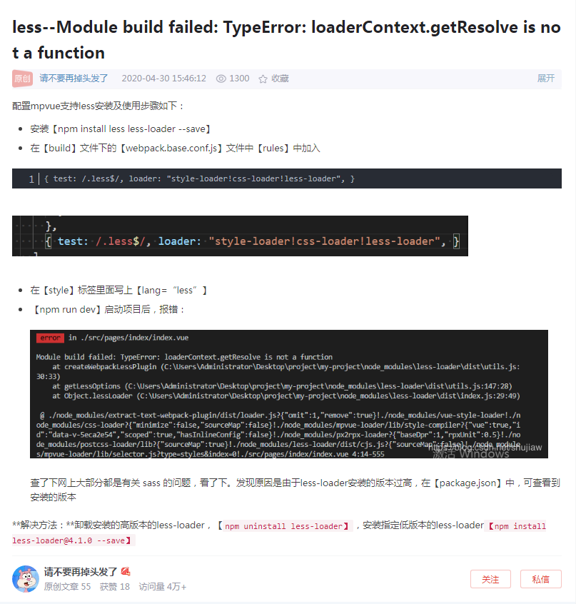

# BUG问题大全

## 1. (编辑器) VsCode代码格式化与Eslint发生冲突

- ```javascript
  // 在同 package.js 层级创建 .prettierrc.js 内容如下---↓
  {
      // 字符串用单引号来表示
      "semi": false,
      // 移除分号
      "singleQuote": true
  }
  ```


## 2. (git) git 在上传的时候因为大小问题第三方包不会上传，如果要上传做下面4步

- 1) 找到 Vue 根目录下的 .gitignore 文件
- 2) 删除掉不能上传的文件名
- 3) 保存
- 4) 重新打包(npm run dev)


## 3. (less) 问题和解决方法如下图



